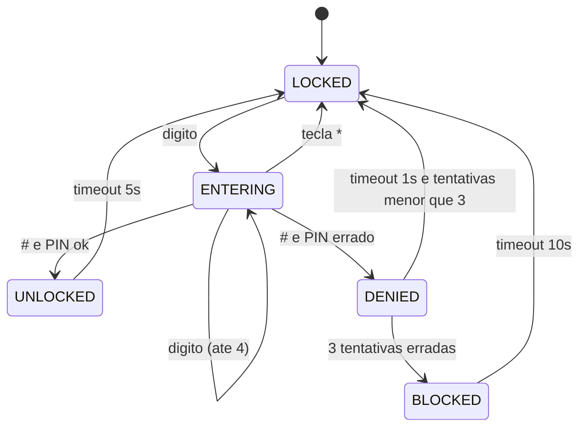

# Processo Seletivo – Intensivo Maker | IoT

### 👤 Identificação do Candidato

- **Nome completo:** Vitória Maciel
- **GitHub:** [vitoriamb](https://github.com/vitoriamb)

---

## 1️⃣ Visão Geral da Solução

**Projeto:** Cofre Eletrônico em ESP32 + MicroPython, simulado no Wokwi.

O sistema bloqueia uma trava (servo motor) até que o usuário digite uma senha de 4 dígitos em um teclado matricial. Um LCD I2C 16x2 mostra instruções e estados, dois LEDs (verde/vermelho) sinalizam abertura/bloqueio e um buzzer emite feedback sonoro de acerto, erro e alarme.

**Como o usuário interage:**

- Digita 4 dígitos no keypad.
- `*` cancela o que digitou e zera o buffer.
- `#` confirma a senha (PIN padrão: `1234`).
- Acertou: trava abre por 5 s, depois religa sozinha.
- Errou: feedback de erro e nova tentativa. Após **3 erros consecutivos**, o cofre entra em modo de **alarme** por 10 s (LED vermelho piscando + buzzer intermitente) e bloqueia novas tentativas.

---

## 2️⃣ Arquitetura do Sistema Embarcado

O firmware está dividido em **três módulos próprios** com responsabilidades bem delimitadas, mais dois drivers reutilizados de domínio público para o LCD.

| Arquivo | Responsabilidade |
| --- | --- |
| [`src/main.py`](src/main.py) | Configuração de pinos, instanciação dos módulos e loop principal não-bloqueante. |
| [`src/keypad.py`](src/keypad.py) | Driver do teclado: varredura linha-a-linha **não-bloqueante** com debounce por estado (só reporta a tecla na transição "soltou → pressionou", evitando autorrepetição). |
| [`src/ui.py`](src/ui.py) | Camada de saída: LCD I2C, LEDs, buzzer (PWM) e servo (PWM 50 Hz). Expõe métodos de alto nível (`mostrar`, `set_led`, `beep_ligar`, `abrir_trava`). |
| [`src/vault.py`](src/vault.py) | Máquina de estados pura. Recebe teclas e ticks de tempo e chama a UI. Não toca em GPIO. |
| [`src/lcd_api.py`](src/lcd_api.py), [`src/i2c_lcd.py`](src/i2c_lcd.py) | Drivers HD44780 + PCF8574 (portados de [dhylands/python_lcd](https://github.com/dhylands/python_lcd), MIT). |

### Fluxo do `main.py`

```python
while True:
    tecla = teclado.scan()         # nao bloqueia
    if tecla:
        cofre.on_key(tecla)        # alimenta a maquina de estados
    cofre.tick(time.ticks_ms())    # evolui timeouts e alarme
    time.sleep_ms(20)              # unico ponto de pausa
```

### Diagrama de estados do cofre



### Pinout (ESP32 DevKit C V4)

| Função | GPIO |
| --- | --- |
| Keypad linhas (saída) | 13, 12, 14, 27 |
| Keypad colunas (entrada pull-up) | 26, 25, 33, 32 |
| LCD I2C SDA / SCL | 21 / 22 |
| Servo (PWM 50 Hz) | 18 |
| LED verde | 19 |
| LED vermelho | 23 |
| Buzzer (PWM) | 5 |

---

## 3️⃣ Componentes Utilizados na Simulação

Definidos em [`diagram.json`](diagram.json):

| Componente | Tipo Wokwi | Função |
| --- | --- | --- |
| Microcontrolador | `board-esp32-devkit-c-v4` | Roda o MicroPython e a lógica do cofre. |
| Teclado matricial 4x4 | `wokwi-membrane-keypad` | Entrada da senha. |
| LCD 16x2 com I2C | `wokwi-lcd1602` (atributo `pins: i2c`) | Exibe estado e instruções. |
| Servo SG90 | `wokwi-servo` | Trava física (0° fechado, 90° aberto). |
| LED verde | `wokwi-led` (`green`) | Indica cofre aberto. |
| LED vermelho | `wokwi-led` (`red`) | Indica cofre trancado e pisca em alarme. |
| Buzzer | `wokwi-buzzer` | Beeps de confirmação, erro e alarme. |
| 2 × resistor 220 Ω | `wokwi-resistor` | Limitação de corrente dos LEDs. |

**Convenção de cores dos fios** (para legibilidade no diagrama):

- Vermelho — alimentação (3V3 / VIN)
- Preto — GND
- Verde — SDA / linhas do keypad
- Azul — SCL / colunas do keypad
- Laranja — sinais PWM (servo, buzzer)
- Amarelo — saídas digitais para LEDs

---

## 4️⃣ Decisões Técnicas Relevantes

**Máquina de estados explícita.** Em vez de `if`s aninhados sobre flags, modelei cinco estados (`LOCKED`, `ENTERING`, `UNLOCKED`, `DENIED`, `BLOCKED`) com transições claras. Cada estado tem uma função `_enter_*` que aplica o efeito visual/sonoro e ações no `tick`. Isso elimina ambiguidades do tipo "estou digitando, mas o cofre está aberto?" e simplifica a verificação manual.

**Temporização não-bloqueante (`time.ticks_ms`).** Todos os timeouts (auto-relock 5 s, retorno após erro 1 s, bloqueio 10 s, alarme 250 ms on/off) usam `time.ticks_ms()` + `time.ticks_diff()`. O loop principal nunca dorme mais que 20 ms, então a UI permanece responsiva. Em sistemas embarcados, qualquer `sleep` longo é um cofre que ignora um `*` para cancelar — exatamente o que queremos evitar.

**Modularização em três arquivos próprios.** Separação clara entre **driver de hardware** (`keypad.py`, `ui.py`) e **lógica de negócio** (`vault.py`). A lógica não conhece pinos: recebe um objeto `ui` injetado. Trocar o LCD por OLED, por exemplo, mexeria apenas em `ui.py`.

**Debounce por transição no keypad.** Em vez de `sleep_ms(50)` após detectar tecla (bloqueante e perde toques rápidos), `scan()` só reporta a tecla quando ela acabou de ser pressionada — guardando a última leitura entre chamadas. Cada `scan()` retorna em microssegundos.

**LCD via I2C (PCF8574).** Em paralelo, o LCD ocuparia 6+ GPIOs. Pelo I2C, são apenas 2 (SDA/SCL) e ainda sobra barramento para futuros sensores. Por isso `wokwi-lcd1602` foi configurado com `pins: i2c` e usei os drivers consagrados `lcd_api.py` + `i2c_lcd.py` em vez de reimplementar protocolo.

**Pinout escolhido.** Todas as linhas/colunas do keypad ficam na fileira esquerda do ESP32 (GPIO 12-14, 25-27, 32-33), enquanto LCD, servo, LEDs e buzzer ficam à direita (GPIO 5, 18, 19, 21, 22, 23). Isso reduz o cruzamento de fios no diagrama.

**CI/CD com fluxo `develop` → `main`.** Um único workflow ([`.github/workflows/ci.yml`](.github/workflows/ci.yml)) cobre os dois branches em build + simulação Wokwi (consistência de ambiente), mas o job `release` só roda em push para `main`: gera tag automática (`vYYYY.MM.DD-shortsha`) e publica `fs.bin` como artifact e GitHub Release. Pull requests para `develop` ou `main` rodam só o build/test, sem release.

---

## 5️⃣ Resultados Obtidos

### Comportamento na simulação Wokwi

- **Boot:** o serial mostra `Cofre iniciado`, o LCD exibe `Cofre Trancado / Digite a senha:` e o LED vermelho fica aceso.
- **Digitação:** ao pressionar dígitos, o LCD mostra `Senha:` na linha 1 e uma máscara `*___`, `**__`, `***_`, `****` na linha 2.
- **Acerto (`1234#`):** servo gira para 90°, LED verde acende, beep curto agudo, LCD `Cofre Aberto / Bem-vindo!`. Após 5 s, religa automaticamente.
- **Erro (`9999#`):** beep grave, LCD `Senha Incorreta / Tentativa N/3`, retorna para tela inicial em 1 s.
- **Cancelamento (`*`):** zera o buffer e volta ao estado inicial a qualquer momento durante a digitação.
- **Bloqueio (3 erros seguidos):** LCD `BLOQUEADO! / Aguarde 10s`, LED vermelho piscando a cada 250 ms com buzzer intermitente. Teclas são ignoradas. Após 10 s, contador zera e cofre volta a aceitar tentativas.

### Resultado no GitHub Actions

- Push em `develop` ou `main` (ou PR): build da imagem Docker → geração do `fs.bin` → simulação Wokwi com `expect_text: 'Cofre iniciado'` → upload do `fs.bin` como artifact.
- Push em `main`: além disso, cria a tag automática e publica o release com o `fs.bin`.

### Atendimento aos requisitos do desafio

- Estrutura mínima (`src/`, `wokwi.toml`, `diagram.json`, `README.md`) presente.
- Simulação Wokwi roda sem erro.
- Pipeline GitHub Actions verde nos dois branches.
- README como relatório técnico completo.

---

## 6️⃣ Comentários Adicionais

### Limitações conhecidas

- **PIN em texto claro** no `main.py`. Em produção, viria de NVS protegido (`esp32.NVS`) ou de um secure element.
- **Sem persistência de tentativas:** reset zera o contador. Um atacante real poderia usar power-cycling como bypass — solução seria salvar o contador no NVS.
- **Comparação não constant-time:** `self._buffer == self._pin_correto` vaza tempo. Para um cofre de baixo risco é aceitável; em alto risco usaria `hmac.compare_digest`.
- **Sem watchdog:** uma exceção não tratada deixa o cofre travado. `machine.WDT` resolveria.
- **Servo sem realimentação de posição:** se o motor falhar, o firmware não percebe.

### Melhorias com mais tempo

- Modo "trocar PIN" protegido pelo PIN atual (estado adicional `CHANGE_PIN`).
- Log de tentativas com timestamp em arquivo no LittleFS.
- Sensor PIR para detectar tentativa de violação enquanto trancado.
- Configuração via `boot.py` separando segredos do código de aplicação.

### Aprendizados

- **Disciplina de não-bloqueante:** todo `sleep` longo é uma falha de UX em embarcado.
- **Separar driver de lógica** facilita teste manual e troca de componentes.
- **Conventional Commits + branches `develop`/`main`** deixam clara a fronteira entre "em desenvolvimento" e "pronto para release".
